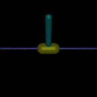

# RL-Mujoco-Projects
A comprehensive framework for training and testing reinforcement learning agents on various MuJoCo environments using TD3 and SAC algorithms.

<p align="center">
  
  
  
</p>
<p align="center">
  
  
  
</p>

## Overview
This project provides implementations of two state-of-the-art reinforcement learning algorithms:
- **Twin Delayed Deep Deterministic Policy Gradient (TD3)**: An enhancement of DDPG that addresses overestimation bias in the critic by using twin critics and delayed policy updates.
- **Soft Actor-Critic (SAC)**: An off-policy actor-critic algorithm that maximizes both expected reward and entropy, balancing exploration and exploitation.

Both algorithms are implemented for various MuJoCo environments, including Ant, HalfCheetah, Hopper, Inverted Pendulum, Inverted Double Pendulum, Walker, and reacher. Humanoid walking, humanoid standup, pusher are not trained due to computation costs that I can't afford at this time.

## Installation
1. Clone the repository:
   ```bash
   git clone https://github.com/CodeKnight314/RL-Mujuco-Projects.git
   cd RL-Mujoco-Projects
   ```
2. Set up the environment:
   ```bash
   bash setup.sh
   ```
   Or manually install dependencies:
   ```bash
   pip install -r requirements.txt
   ```

## Usage
### Training a model
```bash
python -m src.main --model cheetah --mode TD3 --train --config src/cheetah/TD3_config.yaml --path resources/cheetah
```
Options:
- `--model`: Choose from ant, cheetah, hopper, invertedpendulum, inverteddoublependulum, reacher, walker, and more
- `--mode`: Algorithm to use (TD3 or SAC)
- `--train`: Flag to enable training mode
- `--config`: Path to the configuration YAML file
- `--path`: Path to save/load models and results
- `--multi`: Enable parallel environment training
- `--num_envs`: Number of environments to run in parallel (default: 8)

### Testing a trained model
```bash
python -m src.main --model cheetah --mode TD3 --config src/cheetah/TD3_config.yaml --weights resources/cheetah --path resources/cheetah
```
This will generate a video of the agent's performance in the specified environment.

### Hyperparameter Optimization
```bash
python -m src.search --model cheetah --mode TD3 --study-dir runs/cheetah --base-cfg src/cheetah/TD3_config.yaml --n-trials 50
```
Options:
- `--n-trials`: Number of Optuna trials to run
- `--timeout`: Timeout in seconds for the optimization
- `--multi`: Enable parallel environment training for faster optimization
- `--num_envs`: Number of environments to run in parallel during optimization

## Configuration
Configuration files for each model and algorithm are located in the respective subdirectories under `src/`. These YAML files contain parameters such as:

- Learning rates for actor and critic networks
- Network architectures
- Discount factor (gamma)
- Replay buffer size
- Batch size
- Target network update frequency
- Algorithm-specific parameters (exploration noise, entropy target, etc.)

Example TD3 configuration:
```yaml
ac_max: 1
ac_min: -1
actor_lr: 0.001
actor_hidden_dim: 256
critic_lr: 0.001
critic_hidden_dim: 256
memory: 1000000
episodes: 5000
gamma: 0.99
batch_size: 512
target_update_freq: 5
actor_update_freq: 2
td3_exploration_start: 0.25
td3_exploration_min: 0.01
td3_exploration_decay: 1000
td3_noise_clip: 0.5
replay_buffer: 20
```
## Pre-trained Models
The repository includes pre-trained models for several MuJoCo environments in the `resources/` directory. Each environment directory contains:
- `actor.pth`: Actor network weights
- `critic_1.pth` and `critic_2.pth`: Twin critic network weights
- `simulation.mp4`: Video of the agent's performance
